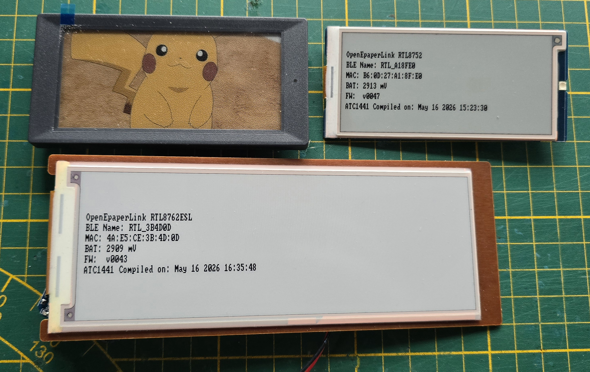
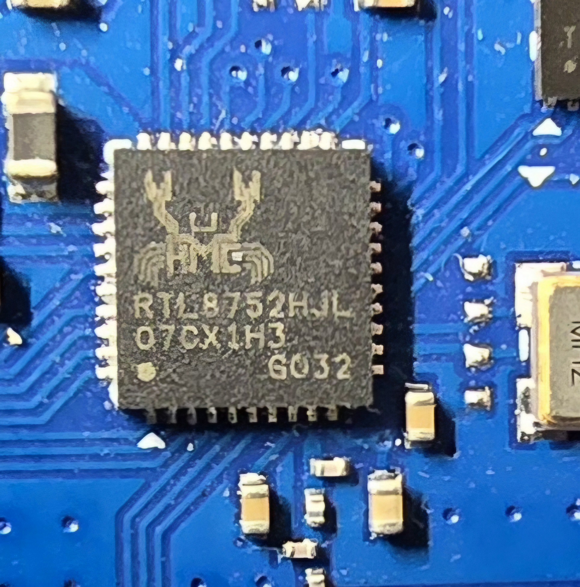
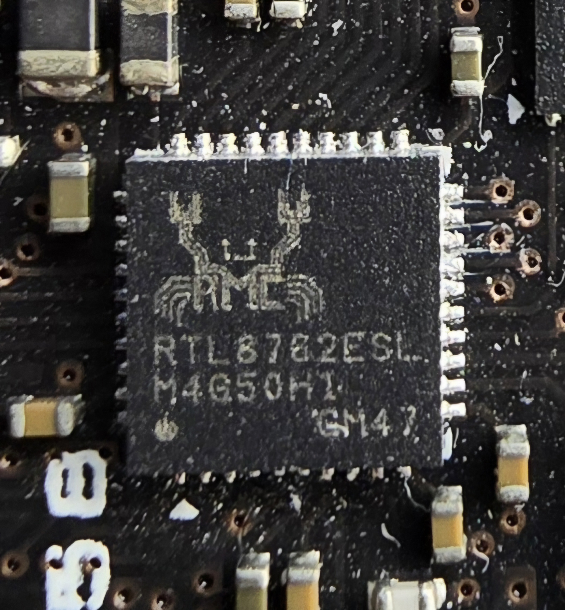
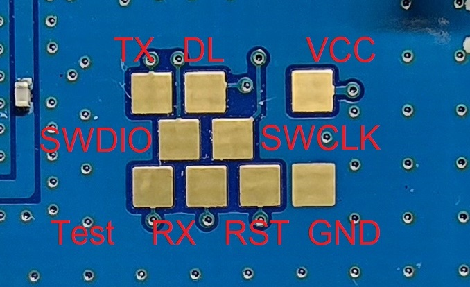

# ATC_RTL_BLE_OEPL

<p align="center">
  
</p>

Custom E-Paper firmware for Realtek RTL8762ESL and RTL8752HJL microcontrollers. This firmware enables the integration of E-Paper displays (Electronic Shelf Labels / ESL) into the **OpenEPaperLink** ecosystem, using either Bluetooth Low Energy (BLE) or 802.15.4 wireless communication.

## Features
- **OpenEPaperLink Compatibility:** Full support of the OEPL protocol for image updates via Bluetooth Low Energy (BLE) or 802.15.4.
- **Image Formats:** Supports RAW formats (1bpp, 2bpp(BWR/BWRY)) as well as ZLIB compressed images for faster transmission.
- **Memory Management:** Efficient use of external SPI flash (EEPROM) to store up to 5 images in different slots.
- **OTA Updates:** Support for Over-the-Air firmware updates via BLE.
- **Ultra-Low Power:** Optimized for minimal power consumption using the Deep Sleep mode (DLPS) of the Realtek chips.
- **Battery Monitoring:** Integrated measurement and transmission of battery voltage to the Access Point.

## Supported & Tested Models
The following models are currently supported and have been verified:
- **ELM35R2C4P:** 3.5" BWRY (Black/White/Red/Yellow), 224x480 pixels, based on **RTL8752HJL**.
- **ELO58R2CRN:** 5.85" BWR (Black/White/Red), 272x792 pixels, based on **RTL8762ESL**.

## Project Structure
The repository contains two separate projects for the different chip variants:

<p align="center">
  
  
</p>

- `ATC_RTL_BLE_OEPL_8752HJL/`: BLE firmware for the RTL8752HJL chip.
- `ATC_RTL_BLE_OEPL_8762ESL/`: BLE firmware for the RTL8762ESL chip.
- `ATC_RTL_ZB_OEPL_8752HJL/`: OEPL(802.15.4) firmware for the RTL8752HJL chip (see below). PLEASE NOTE: This firmware has a breaking bug and hangs after a few hours of working fine, its something with the radio not recovering after sleep

### ATC_RTL_ZB_OEPL_8752HJL - 802.15.4 Variant

This firmware implements the OpenEPaperLink protocol over **IEEE 802.15.4** instead of BLE, targeting the **RTL8752HJL** chip. Although the project is named with a "ZB" (Zigbee) prefix - reflecting the 802.15.4 radio layer used by the chip's SDK - it does **not** run standard Zigbee. It uses the **custom OEPL 802.15.4 protocol**, which is incompatible with regular Zigbee coordinators.


## Prerequisites
Before you start, ensure the following tools are installed:
- **ARM GNU Toolchain:** `arm-none-eabi-gcc` (must be in your PATH).
- **Make:** To run the build scripts.
- **Python 3:** Required for the flashing tool.
- **PySerial:** Install the dependency with:
  ```bash
  pip install pyserial
  ```

## Compiling
1. Navigate to the `gcc` folder of the desired project:
   ```bash
   cd ATC_RTL_BLE_OEPL_8752HJL/gcc
   # OR
   cd ATC_RTL_BLE_OEPL_8762ESL/gcc
   # OR
   cd ATC_RTL_ZB_OEPL_8752HJL/gcc
   ```
2. Start the compilation process:
   ```bash
   make
   ```
   The finished binary files will be located in the `bin/` subfolder.

## Flashing
Flashing is done serially via a USB-to-UART adapter.

<p align="center">
  
</p>

### Hardware Preparation
1. **Wiring:**
   - Adapter **TX** -> SoC **RX**
   - Adapter **RX** -> SoC **TX**
   - Adapter **3.3V** -> SoC **VCC** (Ensure 3.3V is used, higher voltage may damage the chip!)
   - Connect common **GND**.
2. **Download Mode:**
   - **Manual:** Connect the **DL pin** of the tag to **GND** and restart the tag (power cycle or reset). The chip is now in bootloader mode.
   - **Automatic:** You can also use an "auto-reset" circuit (like the one used in ESP32 boards). Connect the adapter's **DTR** and **RTS** signals to the SoC's **RST** and **DL** pins respectively. The flashing tool will then automatically enter the bootloader.

### Flashing Process
The `Makefile` contains predefined commands for flashing. You can specify the COM port directly.

- **Full Flash (Initial installation):**
  Writes both the system blob and the actual firmware.
  ```bash
  make flash-all-pt COM_PORT=COM3
  ```

- **Firmware Update Only:**
  Writes only the app firmware (faster, for subsequent changes).
  ```bash
  make flash-pt COM_PORT=COM3
  ```

*Note: The `-pt` (passthrough) suffix opens a terminal for serial logs after flashing. Exit this with `Ctrl+C`.*

## Usage
After a successful flash, the tag restarts and sends Bluetooth advertisements.

There are several ways to interact with the flashed tag:
- **OpenEPaperLink Access Point:** An OEPL AP can find and manage the tag. The unique ID (MAC address) is displayed in the logs during startup.
- **Home Assistant:** The tag can be integrated into Home Assistant using the [OEPL Integration](https://github.com/OpenEPaperLink/Home_Assistant_Integration).
- **Web-based Upload Tool:** You can upload images directly from your browser using this tool: [ATC_BLE_OEPL_Image_Upload](https://atc1441.github.io/ATC_BLE_OEPL_Image_Upload.html).

---
Based on Realtek RTL8762E SDK v1.5.0 and RTL8752H v1.3.0 SDK.
**Note on Licensing:** All files originating from the Realtek SDK remain under the original license and ownership of Realtek.
